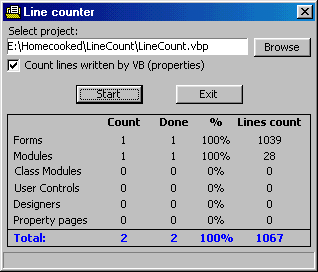



## LineCount

### Description

This code (program) counts how many lines are in your forms, modules, classes, user controls and designers. It shows you how many of them you used in your project.

It can count all lines in file (also properties written by VB) or just program code (without properties).

NOW REPAIRED VERSION: Some minor bugs fixed and added for counting lines in property pages!!!
 
### More Info
 
It's compatible with all versions of vb, but for versions before 6.0 you have to make replacements for Split function.

             |
---                |---
**Submitted On**   |2000-07-26 12:27:40
**By**             |[Zvonko](https://github.com/Planet-Source-Code/PSCIndex/blob/master/ByAuthor/zvonko.md)
**Level**          |Intermediate
**User Rating**    |5.0 (25 globes from 5 users)
**Compatibility**  |VB 5\.0, VB 6\.0
**Category**       |[Complete Applications](https://github.com/Planet-Source-Code/PSCIndex/blob/master/ByCategory/complete-applications__1-27.md)
**World**          |[Visual Basic](https://github.com/Planet-Source-Code/PSCIndex/blob/master/ByWorld/visual-basic.md)
**Archive File**   |[CODE\_UPLOAD81867262000\.zip](https://github.com/Planet-Source-Code/zvonko-linecount__1-10049/archive/master.zip)

